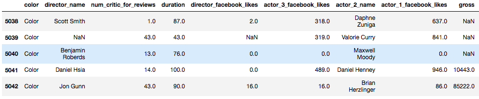

# Good Film // Bad Film

A regression project in Python.

Predicts IMdB movie ratings (from 0 to 10) using pre-release movie metadata.

&#160;&#160;&#160;
&#160;&#160;&#160;

***

## Best Model's Coefficients
Here are some of the strongest coefficients that emerged from my __lasso__ estimator, which performed better than a linear SVR, random forest regressor, or neural net

(Interaction terms are formatted as "variable_x*variable_y", e.g. "durations * actor_1_facebook_likes_box" is the interaction term composed of film runtimes and the facebook popularity of the leading actor.)

How to interpret the above:

In my lasso regresion, 
* __Longer movies__ are predicted to get higher scores. 
* Longer movies with __popular leading actors__ get higher score predictions. 
* Documentaries in color get higher scores. 
* English language films in color tend to do worse. 
* Etc.

Roger Ebert is quoted as saying "No good film is too long and no bad movie is short enough."

## Best Model's Loss

These are the errors from my best model, the LassoCV estimator.

RMSE and Median Absolute Error are in terms of the ten-point IMdB rating.

__Best model's RMSE, compared to dummy regressor:__

In plain English: If you were to naïvely guess the mean IMdB score for every sample in the test set, your average error in terms of IMdB critic score points would be around 1.1. My best model did somewhat better, with a root-mean-squared error of 0.92. 

# Process
## 1. Data Collection
* Grab this [kaggle imdb dataset](https://www.kaggle.com/tmdb/tmdb-movie-metadata):

  

* Extract IMdB ID's from each row, spam [themoviedb API](https://www.themoviedb.org/documentation/api) for more metadata, join it in:

## 2. Data Cleaning
__Structured Data:__
* Keep only seemingly predictive columns (budget, actor popularities, genre, etc.)
* Drop duplicates
* Manage obvious null values (selective imputation, dropping rows)

__Null Value Counts by Column:__

* Manage non-obvious null values (e.g. zero when there is actually no info)
* Bin categorical columns into somewhat balanced metacategories

__E.g.: "Aspect Ratio" Value Counts Before Binning:__

  

__After Binning:__

(Here I used my familiarity with aspect ratios in film to condense this column.)

* Box-Cox transform non-normally distributed continuous value columns

__E.g. Film Budgets: Vanilla__

 

__Film Budgets: Box-Cox Transformed__

  

__Unstructured Data (Plot Synopses):__
* Tokenize corpus. Remove stopwords, punctuation
* Part-of-speech tag each token
* Lemmatize words by POS
* Vectorize plot texts with n-gram CountVectorizer
* TF-IDF normalize vectors

## 3. Feature Engineering
* One-hot encode categorical variables

E.g. "genre" column gets split into many binary variables:

  

* __Train/Test split happens here__
* Drop multicollinear features

Multicollinearity of features as a heatmap:

* Generate interaction terms
* MinMax scale features

## 4. Model Building / Benchmarking
__Models evaluated:__
* Baseline: Dummy regressor
* Linear: Lasso
* Non-Parametric: Linear SVR
* Tried incorporating vectorized text features (with PCA) — Not great
* Tree-based: Random forest regressor
* Neural Net

Used Pipeline + GridSearchCV to search for better hyperparameters on text-based regressor and random forest.

__Model Loss Metrics:__
